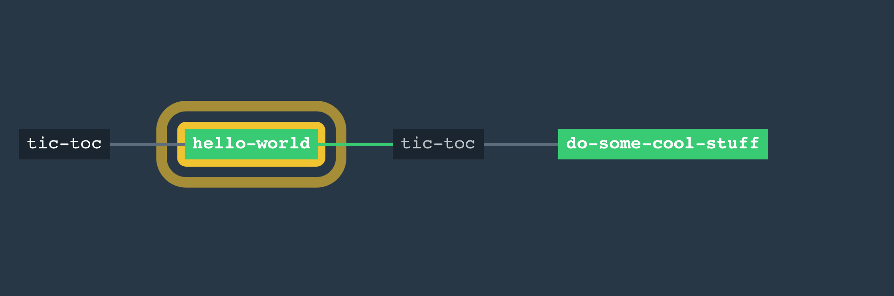
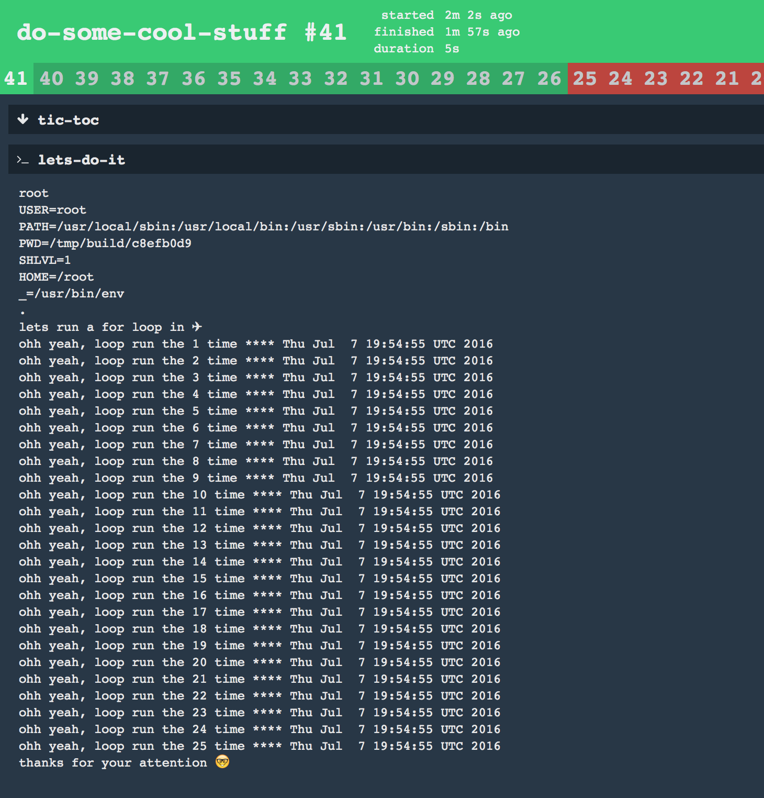

# 🚀 Concourse Startup

### Why?
Because [Concourse Ci](https://concourse.ci) is one of the best CI/CD Tools that I ever used and I though it could be nice to share this project, if somebody will play with Concourse. I have to be honest, I tested it only on the mac. But if somebody would run it on linux or windows, I'm open for pull requests.

### Requirements

Installed [Vagrant](https://www.vagrantup.com/docs/installation/)

### How to

```
bash$ git clone https://github.com/idev4u/concourse-startup.git
bash$ cd concourse-startup
bash$ ./startup.sh
```

example output
```
==> INFO: ⚙ checking if concourse already exist
==> INFO: ⚙ Yes! It's already there.
==> INFO: ⚙ Ups, there is something strange! Concourse is not up!
==> INFO: ⚙ checking if concourse is already running
==> INFO: ⚙ Yes! Concourse is NOT already up.
==> INFO: 🚀 Startup Concourse
Bringing machine 'default' up with 'virtualbox' provider...
...
==> INFO: ⚙ open the ✈ pipeline in your default browser
==> INFO: ✈ Done, have fun with Concourse
```

## Pipeline

### Overview
here is the example pipeline, which is based on a single config file.
The pipeline will triggert from a 2 minutes timer.




And this is the output from one of the two time triggert job


###  Configuration

this is the config snippet of the time resource

```
- name: tic-toc
  type: time
  source: {interval: 2m}
```
this is the part of bash block which produce the output in the job __do-some-cool-stuff__

```
  run:
    path: bash
    args:
    - -ec
    - |
      whoami
      env
      find .
      echo -e "lets run a for loop in" "\xE2\x9C\x88"
      for i in {1..25}; do printf "ohh yeah, loop run the $i time **** $(date) \n" ; done
      echo -e "thanks for your attention" "\xF0\x9F\xA4\x93"
```

**hint**

only if fly not get autmatically installded, then you get it from [here](https://github.com/concourse/fly)